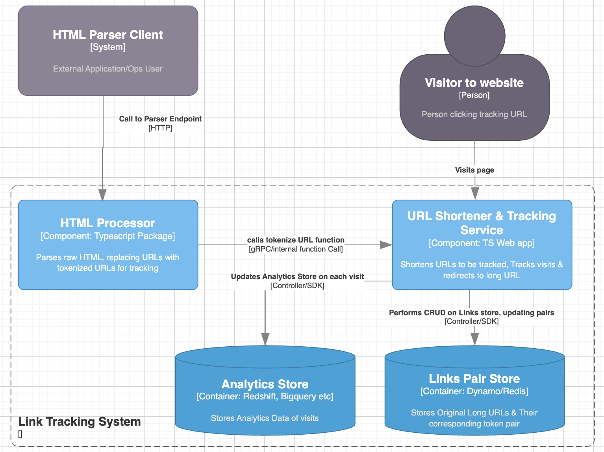
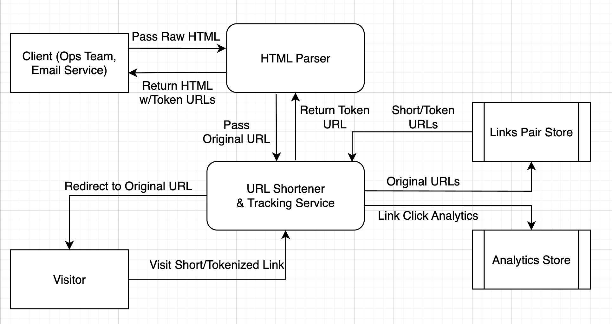

# System Design Document: Link Clicks Tracking

## Introduction

This document outlines a design for a URL Shortening & Tracking Service.\
The main purpose of this system is to track user interactions on URLs in HTML content served in emails. 

The system is split into two main components
- HTML Processor
- URL Shortening & Tacking Service

### Functional Requirements:

#### HTML Processor
- Parse Raw HTML Input, replacing URLs with a shortened, unique tracking URL

#### URL Shortener & Tracking Service
- Generate shortened tracking URLs from a regular URL, storing the matched pair
- Track visits to shortened URLs
- Redirect visits to shortened URLs to their paired long URL

### Non-Functional Requirements:
- Scalability: The URL Tracking Service needs to handle 1000s of clicks daily/hourly, it may scale to 1 or 0 in quiet hours. (Do double check figures with product/business team)
- High Availability: The system must be highly available i.e. have minimal downtime when users click links. 
- Fault Tolerance: The overall System must remain available even if individual compoents fail. 
- High throughput, low latency: The System must respond to large amounts of requests speedily with low latency
- Observability, Monitoring, Metrics: The System must provide good visibility into health/uptime, performance & the lifecycle of requests serviced by various workflows & their components.      

## High-Level Architecture

This section provides an overview of the main components and their interactions.

- System Overview: 
  -  The Link Clicks Tracking system is designed to track user interactions with URLs embedded in HTML content. 
  - The system consists of two main services: the HTML Processor and the URL Shortening & Tracking Service. 
  - The HTML Parser identifies URLs in raw HTML & replaces them with unique shortened tracking URLs, returning the modified HTML. 
  - The URL Shortening & Tracking Service generates these shortened URLs/Tokens, logs visits and redirects users to the original destination URL. 
  - Analytics metadata is collected and stored for reporting and analytic purposes.

- Component Identification:
  - HTML Parser: A relatively independent service or package, Parses HTML input, returning the same HTML with updated tokenized short links. 
  - URL Shortener/Tracking Service: Accepts URLs, generates the shortened token URL. Tracks analytics & visits to those URLs, redirecting them to the original long URL
  - Datastore: stores URL pairs for lookups & redirects, Stores analytics data from visits to URLs. 

- Data Flow Summary: There are two main sources of data into the system. 
  - The Raw HTML provided to the Parser. this results in a parsed HTML text with updated links & is returned to the client. We also store KV pairs of the URLs & their Shortened match. 
  - Analytics generated when users click links & visit Shortened URLs, we store certain metadata about the visitor. 

## Detailed Design

### HTML Parsing Service
- Functionality
- DS
- Algorithms

### URL Shortening & Tracking Service
- Functionality
- DS
- Endpoints/Functions (OpenAPI/Swagger would be nice here)
- Logic (redirection, logging)

### Datastore & DB 

We have the following main datastructures:

**URL Pairs**
- These are Key Value Pairs of Shortened URL Tokens & Their corresponding long link
- Tokens & URLs are strings, both unique. 
- Tokens may be UUIDs, Trace IDs or similar convention. 

**Analytics Record**
- This table stores details for clicks, A KV pair works well too here. 

Good candidates for keys would be 
- URL Tokens: Good for searching/filtering analytics records by individual URLs, multiple visits to same URL. 
- Timestamp/Datetime: Good for filtering by date ranges, timestream, trends etc.

Ultimately either is suitable, with the alternate being stored as an indexed "column" \
Values May be Sets, JSON blobs etc of analytics data (e.g. device, IP, OS etc).\
At present the analytics requirements are unclear hence a flexible option will allow the system to adapt to future requirements. 

Based on the following criteria: 
- Data Access Patterns: Read Heavy workload, eventual consistency writes if HTML content is parsed in bulk by cronjobs for example. Ad Hoc writes can be more syncronous
- Data Relationships: There are no strict relational requirements or complex data relationships.
- Flexible Analytics Requirements: Analytics data stored by visits to the URLs are unclear, quite likely would change in future and grow to accomodate new functionality.

In my opinion it would be best to use a NoSQL Database such as DynamoDB, MongoDB etc for tracking visits & Analytics data. \
At the expense of additional work, one may store URL/Token pairs in Redis separately from Dynamo for extreme speed. Albeit Dynamo with DAX caching for example may be suitably fast in retreiving long URLs too. 

Long Term/Beyond the scope of this spec is analytics, we may implement an ETL pipeline to long term/big data tools such as redshift/looker etc. 

---

### Data Flow & Detailed Diagram 

Data Flow Diagram:

---

### Considerations

In my opinion the Parser should own the URL Shortening & Storage domain, unless there is a specific requirement or reason in the bigger picture. \
This will allow the Tracking Service to have the sole responsibility of quering Token/Link Pairs & Storing Analytics, allowing focus on robustness, uptime and performance. It is customer facing whereas the parser is an internal tool. \
This also removes the dependency of the Parser on the Tracking Service. 
As they are quite decoupled already. 

This will also allow independent architecture approaches, The Parser can be a job or serverless application whereas the Visit & Tracking service can be tailed to handle heavy bursts, be more resilient. \
For future use we would probably also like to view analytics generated by visits, this could be done by off the shelf tools such as Redshift, Looker Studio etc. It may be a custom inhouse dashboard too. 

---

### Scaling 

**Architecture**

Large volumes of requests, links & analytics data overtime point to highly scalable horizontal architectures from the DevOps perspective:
- Serverless (Lambda, Cloud Functions etc)
- Long running instances, EC2, Kubernetes 
- Good for load balancing, sudden spikes in visits & clicks.

From a code implementation perspective there are various options:
- Microservices: Highly scalable, resilient and fault tolerant, bit of work to build and get running. May be overkill
- Monolith: Great for building things in start up environments, struggle to scale and cause a lot of pain in growing, adapting and tackling tech debt. Not recommended.
- EDA: Nice & Async, good for fault tolerance, scaling, also a fair bit of work to build out. 

--- 

**Data**

Data requirements are roughly calculated below, I've included costing as well. 

In terms of data Token/URL Pairs a quick envelope calculation:\
(Key: Value) = (UUID: 16 Bytes + Long URL(Max 2kb)) ± 2kb per Token/URL Record\
x 100 short links generated per hour\
x 24 hours x 365 days
= 1.75 GB per year, 876k records 

This ignores TTL & expiry of links\
Fun Fact: AWS Elasticache is ± 15-20 ZAR a day for 1.75gb

For Analytics Recording:\
Record size ± 1kb (thumbsuck)\
x 24000 records per day (1000 per hour)
x 365 days
= 8.76 GB Roughly, 8.76m records annualy

DynamoDB:
- 11 ZAR per Million write request units
- 2 ZAR per Million read request units
- 5 ZAR per GB/month 

Redshift:
- Leave for later

---

#### Fault Tolerance

Structurally the system should also take into account and handle various disasters
- DDOS: This can be mitigated by rate limiting, WAF, Cloudflare tooling  
- DB Outage: Use Queues to buffer & replay events/messages when services are back up
- Network Outage: Circuit Breakers, bulkhead patterns etc. 
- Service failure: Implement health checks, alerting with opsgenie etc. 
- Data Corruption: Ensure regular backups are configured in the event of human error, data poisioning etc. 

---

#### Monitoring & Observability 

As part of the code implementation certain tooling & practices are ideal.

- logging of requests, their lifecycle through each step in the flow. This can be done natively on AWS with cloudwatch, ELK, Grafana etc. 
- logging of service health, endpoint metrics, 
- resource usage, so we can optimize billing, forecast expenses & load testing etc
- Implement cloud monityoring tools such as DataDog, Sentry 

## Implementation Steps

// TODO: Details:
SDLC Stuff, Devops, DBA, SRE, QA, Dev Work